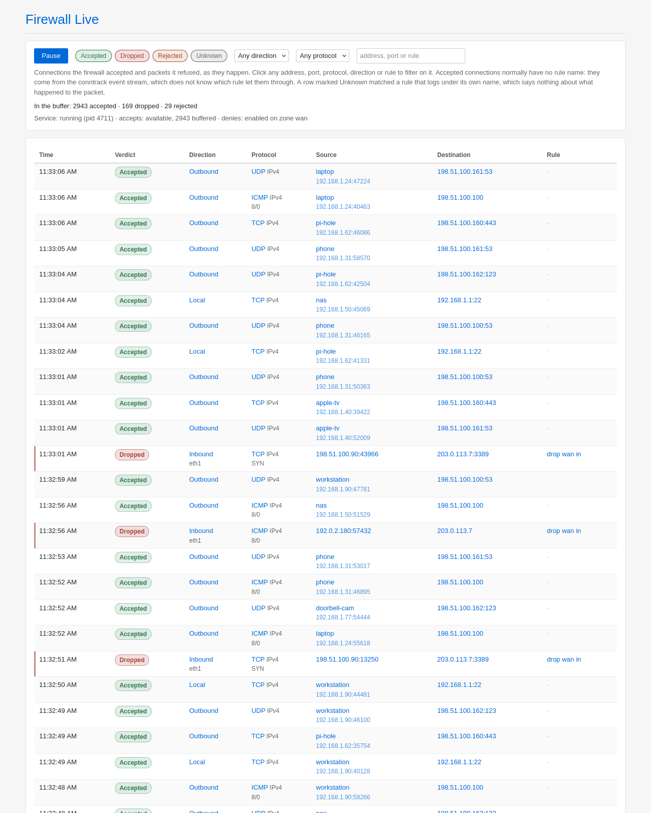
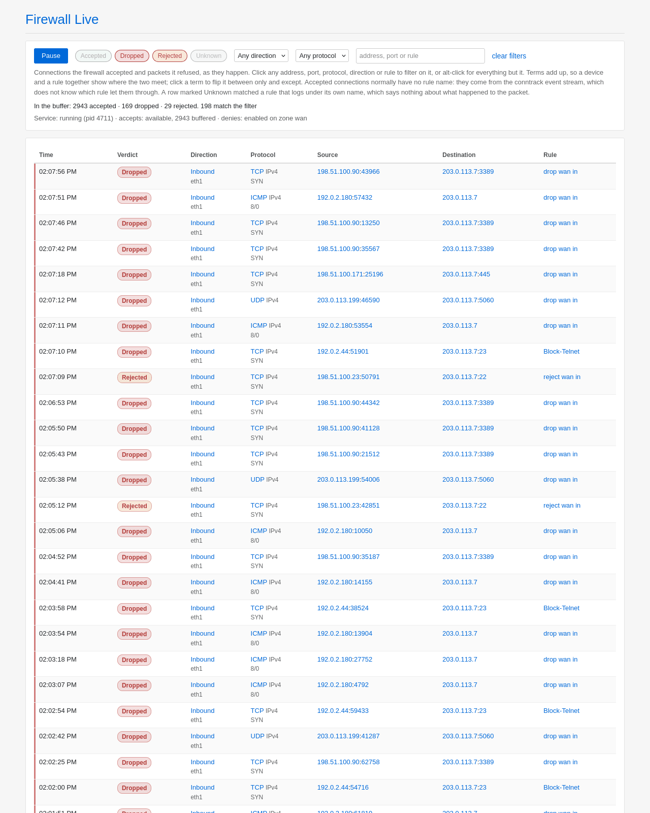
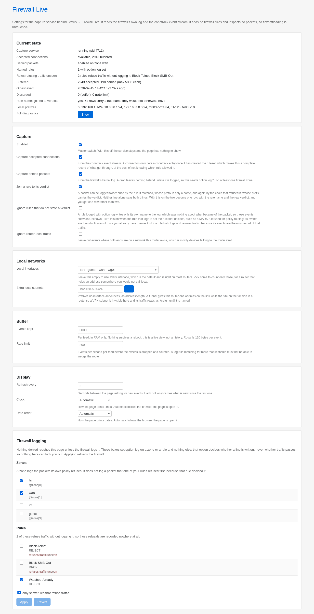

# luci-app-fw-live 1.0.6

A live view of what your firewall is accepting and refusing, for OpenWrt. It
shows connections as they happen, under **Status → Firewall Live**, with a
*Live* tab and a *Settings* tab.

It measures nothing and adds nothing to your ruleset. It reads two feeds the
kernel already produces and keeps the last few minutes of them in RAM. No
packet inspection, no extra firewall rules, and no effect on software or
hardware flow offloading.

Click any address, port, protocol, direction or rule and the view filters on
it. **Pause** freezes the tail so you can read a row without it scrolling
away; nothing is lost while it is paused, and resuming delivers everything
that arrived in the meantime.

## The one thing to know before you start

Accepted and denied traffic reach this page by completely different routes,
and that shapes what you see:

| | where it comes from | rule name? |
| --- | --- | --- |
| **accepted** connections | the conntrack event stream | no |
| **denied** packets | the firewall's own kernel log | yes |

That asymmetry is the shape of netfilter, not a shortcut. A drop is an event
that only exists if something logs it. An accept, on the other hand, leaves a
conntrack entry behind, and that entry is only created once the packet has
cleared the whole ruleset, which makes it a complete record of everything that
got through, for free.

Two consequences:

- **Accepted connections normally have an empty Rule column.** Conntrack knows
  a connection was allowed; it does not know which rule allowed it. If you
  want a name on one specific kind of traffic, set `option log '1'` on that
  uci firewall rule; it then also arrives through the log feed, carrying its
  name. Two things to expect when you do: that event's verdict shows as
  **Unknown**, because fw4 puts only the rule's name in the log prefix and one
  rule name can cover both traffic it allows and traffic it refuses, unless
  the conntrack feed can settle it. See [Naming one rule](#naming-one-rule).
- **Nothing denied shows up until firewall logging is on.** See below.

## Requirements

`conntrack` and `rpcd-mod-ucode`. On OpenWrt 25.12 and newer:

    apk add conntrack rpcd-mod-ucode

On 24.10 and older:

    opkg install conntrack rpcd-mod-ucode

`logread` is part of busybox and is always there.

Developed and verified on 24.10 (mediatek/filogic). 25.12 replaced opkg with
apk and gets its own package below; nothing else about this release is specific
to a version, but it has not been run on 25.12 hardware.

## Install

**Option A: the prebuilt package.** Both are architecture independent, so the
same file works on any target. Take the one your release can install, from the
[Releases](../../releases) page.

OpenWrt 25.12 and newer, `luci-app-fw-live-<version>.apk`:

    scp luci-app-fw-live-1.0.6-r1.apk root@192.168.1.1:/tmp/
    ssh root@192.168.1.1 'apk add --allow-untrusted /tmp/luci-app-fw-live-1.0.6-r1.apk'

OpenWrt 24.10 and older, `luci-app-fw-live_<version>_all.ipk`:

    scp luci-app-fw-live_1.0.6-1_all.ipk root@192.168.1.1:/tmp/
    ssh root@192.168.1.1 'opkg install /tmp/luci-app-fw-live_1.0.6-1_all.ipk'

**Option B: no package manager.** Copy the source tree to the router and run
`install.sh` on it:

    scp -r luci-app-fw-live-src root@192.168.1.1:/tmp/
    ssh root@192.168.1.1 'sh /tmp/luci-app-fw-live-src/install.sh'

`install.sh --remove` undoes it.

**Option C: OpenWrt SDK.** Copy `package/luci-app-fw-live` into the SDK, select
it in `make menuconfig` under LuCI → Applications, then
`make package/luci-app-fw-live/compile V=s`.

Either way, check it came up:

    fwlive-status

## Turning on firewall logging

Accepted connections appear immediately. Denied packets appear only once a
firewall zone has logging enabled, because until then the kernel writes
nothing to log.

**Settings → Firewall logging** has a checkbox for every zone and every rule.

It writes one firewall option, `log`, and nothing else. That option decides
whether a line is written, never whether a packet passes, so no box on that
page can lock you out of your router. Applying reloads the firewall.

The `wan` zone is the one worth doing first: that is where unsolicited traffic
arrives.

If you would rather do it over ssh, `fwlive-status` prints the same commands
with the right section already filled in:

    uci set firewall.@zone[1].log='1'
    uci commit firewall
    /etc/init.d/firewall reload

One caveat, and it is uci's rather than this package's: committing applies
everything staged for the `firewall` config, so if you had unsaved firewall
changes from elsewhere, they go in too. The page tells you when that happened.

### What zone logging does not cover

Zone logging covers the packets your **zone policy** refuses. It does not
cover a packet refused by a **rule**, because a rule with target REJECT or
DROP decides the packet itself and it never reaches the zone's logging rule.
Those refusals are then in no log line, and having been refused they are in no
conntrack event either. They happen and nothing anywhere records them.

That is a property of netfilter, not something this package can work around,
and it means there is no single switch that covers everything for good.

What it can do is stop you having to remember. The Settings panel marks those
rules in red, and every status check reports them:

    unlogged denies:   2 rules refuse traffic without logging it: Block-Telnet, Block-SMB-Out
    rule logging fix:  uci set firewall.@rule[3].log='1'; uci set firewall.blocksmb.log='1'; uci commit firewall; /etc/init.d/firewall reload

It also appears on the live page's status line. Add a deny rule next month and
the page tells you it cannot see it, rather than you finding out by noticing
an absence, and the box to fix it is one click away.

### What logging costs, and how to keep it down

Log volume is the cost, not CPU time in the data path: the rules fw4 adds for
logging sit at the end of a chain that a refused packet was going to reach
anyway. Nothing is written to flash either, unless you have configured
`log_file` yourself. OpenWrt's logd keeps a circular buffer in RAM, so the real
price is that a chatty firewall pushes everything else out of `logread` before
you get to read it.

How chatty it actually is, is on the status line:

    event rate:        7.6/s accepted, 3.6/s denied

A wan zone facing the open internet is usually background noise. A busy
internal zone, or one device stuck in a retry loop against a rule that refuses
it, is a different matter: on the router this was developed against, a single
blocked device produced 203 of the 213 outbound rejections in one minute.

Four things bring it down, roughly in order of how much they help:

- **Log the rules you care about instead of whole zones.** Leave zone logging
  off and put `option log '1'` on the individual rules you want to watch. You
  see those and nothing else, and the status line tells you when a new deny
  rule needs the same treatment. The cost is that those events show as
  Unknown, for the reasons in [Naming one rule](#naming-one-rule).
- **Rate limit the log rule itself**, so the firewall stops writing rather than
  this package throwing events away afterwards:

      uci set firewall.@zone[1].log_limit='10/minute'
      uci commit firewall
      /etc/init.d/firewall reload

  Check it took with `fw4 print | grep limit`.
- **Give logd a bigger buffer**, so firewall traffic stops evicting everything
  else:

      uci set system.@system[0].log_size='256'
      uci commit system
      /etc/init.d/log restart

- **Fix the noise at the source.** A device hammering a rule that refuses it is
  usually retrying because it got a REJECT; a DROP makes it wait instead.

Keeping the feed out of the system log entirely is possible in principle and
not supported here: see
[Why this reads the log rather than a socket](#why-this-reads-the-log-rather-than-a-socket).

## Naming one rule

Zone logging gets you every refused packet, with the zone's verdict in the
prefix. To put a **name** on one particular kind of traffic, accepted or
denied, set `option log '1'` on that individual firewall rule.

Tick it in **Settings → Firewall logging**, or over ssh:

    uci set firewall.@rule[7].log='1'     # by index, or by name:
    uci set firewall.myrule.log='1'
    uci commit firewall
    /etc/init.d/firewall reload

That rule's packets then appear with its name in the Rule column.

### Where the verdict comes from

fw4 writes only the rule's **name** into the log prefix, and a name is not a
verdict. A rule called `Block-Internet` was seen logging both packets it
let through to a local resolver and packets it refused to the internet, under
one identical prefix. So the line itself does not say what happened.

The verdict is usually recoverable anyway, because a refused packet gets
logged **twice**: once by the rule it matched, and again by the chain that
refuses it, whose prefix does carry the verdict. Both lines describe the same
packet and carry the same IP `ID=`, so the two are folded into one row with
the rule's name and the real verdict:

    22:46:29  Rejected  Outbound  TCP  192.168.1.31:46446 -> 198.51.100.111:443  Block-Internet

That is `merge_rules`, and it is on by default. Turn it off and you get the two
rows the log actually contains, one **Unknown** with the name and one
**Rejected** without it.

A packet can also match **several** rules that log, each writing its own name
and none of them a verdict. That is still one packet, so it stays one row and
the Rule column becomes the path it took:

    09:39:47  Unknown  Local  UDP  192.168.1.31:53578 -> 192.168.30.20:53  Block-Internet > Block-DNS2

One thing that deliberately does **not** get folded together: a broadcast
flooded to four bridge ports produces four log lines sharing an IP `ID=` and a
five tuple, differing only in which port they left by. Those are four
forwarding decisions, not one packet logged four times, and they stay four
rows.

### When the log never says

Sometimes no line for that packet carries a verdict at all: the rule that
refused it logs only its own name, and nothing else logs it. The log alone
cannot tell you what happened.

The other feed can, for one half of it. A packet that is allowed through
leaves a conntrack entry behind and a refused one does not, and fw4 accepts
established traffic **before** any rule runs, so everything reaching a rule is
a new connection. A matching conntrack event is therefore proof the packet was
allowed, and such a row is reported as **Accepted**, keeping the rule's name.

The conntrack event that proved it is then not shown a second time. The two
are one connection, and the row that is kept is the one carrying the rule's
name and the interface it came in on.

Only that half is inferred. No conntrack entry is not proof of a refusal, so
those rows stay **Unknown** rather than being guessed at: the accepted feed may
be switched off, or the event may have aged out of the buffer. In a normal
setup, though, Unknown after that check means nothing recorded the packet as
allowed, which in practice means it was refused. The status line counts how
many rows were resolved this way.

Zone and default rules never need any of this: fw4 spells the verdict out in
their prefixes itself (`reject wan in: `).

### Why they are captured at all

Since conntrack already reports everything that was accepted, an Unknown row
often is redundant. Often, not always, and the exception is the one case that
matters most.

A rule whose target is REJECT or DROP **decides** the packet. It is refused
there and then, so it never reaches the zone rule that would otherwise log it,
and conntrack never sees it either because nothing was accepted. That single
Unknown row is the only record anywhere that the connection was attempted and
blocked. It is also the most natural reason to turn per-rule logging on in the
first place: you have a rule called `Block-Telnet` and you want to watch it
fire. Never reading these lines would show you nothing at all.

A rule that only marks or classifies, and lets the packet carry on, is the
opposite: something further down decides it, so the row really is a duplicate.
That is the case `ignore_unknown` exists for.

There is a second reason that holds either way. The conntrack feed knows
nothing about interfaces or rules, so the log row is the only place the
incoming interface, the bridge port and the rule name appear. Even a
"redundant" Unknown row tells you which access point a client is on, which
nothing else on the page can.

### Hiding them

Two ways, and they are for different situations.

**On the router**, if these rows are never useful to you: set
`ignore_unknown`, either in **Settings → Capture** or with

    uci set fw-live.main.ignore_unknown='1'
    uci commit fw-live
    /etc/init.d/fw-live reload

They are then not captured at all, which also stops them taking up buffer
space and rate budget. This is the right switch when the rule that logs is not
the rule that decides, because then they are duplicates by construction.

**In the browser**, if you want them sometimes: untick **Unknown** in the
verdict filter. The choice is remembered, so it is once rather than every
visit, and the summary line keeps counting them so you can see they are still
being captured.

Whether that loses you anything depends on the rule, and the answer is less
obvious than it looks, because **a rule that logs a packet is not necessarily
the rule that decided it**, even when its target is REJECT.

If the rule really is the one refusing the packet, it is also the only thing
that logs it, so hiding Unknown hides refused traffic.

But a rule can log far more than it acts on, and its refusals can be logged
under a name that is not its own. A REJECT rule seen in the wild, with
`option src '*'` and `option dest 'wan'`, was built by fw4 into a rule that
matches only the source MACs, logs, and then jumps into a shared chain that
does the actual refusing. So it logged every packet from those devices,
including ones going to a local DNS server and a LAN broadcast it had no
intention of refusing, while the packets it did refuse were logged a second
time under the shared chain's prefix, `reject wan out`. Two thirds of its log
lines told nobody anything. A rule that only marks or classifies, such as a
MARK rule for policy routing, behaves the same way by design.

The general point: a log prefix names whatever wrote the line, not necessarily
whatever decided the packet.

The test below tells you which you have, and it is worth running rather than
reasoning about.

A quick way to tell which you have: look at whether the row came out
**Rejected** with the rule's name on it, which means the two lines were found
and merged, or stayed **Unknown**, which means nothing refused that packet.
In the log itself, the `ID=` field is the same on both lines:

    logread -e 'IN=' | tail -20

Two lines for one `ID=` means the rule is not the one deciding, and you can
hide Unknown without losing anything.

Also worth checking: whether the rule logs packets it was never meant to
refuse. If its lines include destinations the rule does not cover, its logging
is costing you volume and telling you nothing, and the honest fix is to turn
`option log` off on that rule rather than to filter it out afterwards. The
checkbox for that is in Settings.

## Reading the page

| column | what it is |
| --- | --- |
| Time | when the follower read the event, not the kernel's uptime stamp |
| Verdict | accepted, dropped, rejected, or unknown. Denied rows carry a red edge |
| Direction | inbound, outbound or local, worked out from your own prefixes, with the interfaces underneath |
| Protocol | TCP, UDP, ICMP or the bare protocol number, plus TCP flags or ICMP type/code underneath |
| Source | the host name over the address, resolved in your browser from LuCI's host hints |
| Destination | the same, for the far end |
| Rule | the firewall log prefix. Empty for most accepted connections, as above |

The interfaces under Direction are written `bridge/port` where the packet
crossed a bridge, so `br-lan/wlan0` means it arrived on the `br-lan` bridge
from the `wlan0` radio. That is often the most useful thing on the row: it
tells you which access point a client is actually on. It also keeps a
broadcast honest, since one of those is logged once per bridge port it is
flooded to and the port is the only thing telling those rows apart.

**Direction** compares both ends against the prefixes this router owns, which
`fwlive-subnets` reads from `ubus call network.interface dump`. Local to
foreign is outbound, foreign to local is inbound, and both local is `Local`.
Two caveats it is honest about: a scanner on the same subnet as your own wan
address reads as `Local`, and IPv6 prefixes are matched to the nearest nibble,
which is exact for the /64 and /56 a router hands out and best effort
otherwise.

The summary line counts the **whole buffer**, not the page, so it stays
meaningful while a filter is on.

## Configuration

Everything is editable under **Status → Firewall Live → Settings**, which also
shows whether the capture service is alive, whether each feed is working, and
what it would take to fix either one. Save & Apply restarts the service.

The same options live in `/etc/config/fw-live`:

| option | default | meaning |
| --- | --- | --- |
| `enabled` | `1` | master switch for the capture service |
| `accepts` | `1` | capture accepted connections from conntrack |
| `denies` | `1` | capture denied packets from the firewall log |
| `buffer_size` | `5000` | events kept per feed, in RAM only |
| `max_rate` | `200` | events/second per feed before the excess is shed |
| `poll_interval` | `2` | how often the page asks for new events, seconds |
| `ignore_local` | `0` | drop events with both ends on a local network |
| `local_network` | every interface | list: uci network interfaces that count as local |
| `local_subnet` | none | list: extra local prefixes, as `address/length` |
| `merge_rules` | `1` | fold a rule's log line into the verdict line for the same packet |
| `ignore_unknown` | `0` | drop log events whose prefix does not state a verdict |
| `time_format` | `auto` | clock: `auto`, `24` or `12` |
| `date_format` | `auto` | date order: `auto`, `dmy` or `mdy` |

    uci set fw-live.main.buffer_size='20000'
    uci commit fw-live
    /etc/init.d/fw-live reload

**Nothing survives a reboot, by design.** The whole buffer is in `/tmp`, which
is RAM. This is a live view, not a history: at the default of 5000 events per
feed it costs roughly 1.2 MB of RAM and holds anywhere from a few minutes to
several hours depending on how busy the network is. If you want to know how
much each device transferred last Tuesday, that is a different question and
needs a different tool.

`max_rate` is a safety valve, not a tuning knob. If a log rule starts matching
far more than it should, the excess is counted and dropped rather than allowed
to fill RAM; the count shows up as `discarded` in the status output and on the
page. `ignore_local` is worth turning on if most of what you see is devices
talking to the router itself.

What counts as local decides the direction column and what `ignore_local`
leaves out. Every address the router holds is found on its own, so both list
options are usually unset. `local_subnet` is the one worth knowing about: a
tunnel gives the router one address on the link while the site on the far side
is a route, so a VPN subnet is invisible to netifd and its traffic reads as
foreign until it is named.

## Troubleshooting

Work down this list; each step tells you which layer is broken.

**Start here**

    fwlive-status

That reports the service, both feeds, the buffer and anything discarded, and
prints the commands to fix whichever feed is not working. Almost everything
below is the longer version of a line it already told you.

**The page is empty and stays empty**

    /etc/init.d/fw-live status
    ps w | grep fwlive-follow
    logread -e fw-live

If procd doesn't know the service at all, the init script isn't executable or
isn't enabled: `chmod +x /etc/init.d/fw-live && /etc/init.d/fw-live enable &&
/etc/init.d/fw-live start`.

**Nothing denied ever appears**

    uci show firewall | grep -i log

If nothing comes back, no zone has logging on: see [Turning on firewall
logging](#turning-on-firewall-logging). If a zone does have it, check the
kernel is actually writing the lines:

    logread -e 'IN='

**Nothing accepted ever appears**

    which conntrack
    cat /proc/sys/net/netfilter/nf_conntrack_events
    conntrack -E -e NEW

`nf_conntrack_events` must not be `0`. If it is, the kernel emits no events at
all and the accept feed cannot work:
`sysctl -w net.netfilter.nf_conntrack_events=1`, and
`/etc/sysctl.conf` to make it stick.

**The Direction column says Unknown for everything**

    cat /tmp/fw-live/subnets
    ubus call network.interface dump | head

That file is written by `fwlive-subnets` at service start. If it is empty,
`jsonfilter` or `ubus` did not answer; run `/usr/bin/fwlive-subnets` by hand
and read the error.

**The LuCI page is missing from the menu**

    ls /www/luci-static/resources/view/fw-live/main.js
    ls /usr/share/luci/menu.d/luci-app-fw-live.json
    rm -rf /tmp/luci-indexcache /tmp/luci-indexcache.* /tmp/luci-modulecache
    /etc/init.d/rpcd restart
    /etc/init.d/uhttpd restart

Then log out of LuCI and back in: the menu and the ACL list are resolved when
your session is created, so a stale session hides a freshly installed page.

**The page is there but empty or erroring**

    ls /usr/lib/rpcd/ucode.so                 # rpcd-mod-ucode installed?
    ubus list | grep luci_fw_live             # backend registered?
    ubus call luci_fw_live status '{}'
    ubus call luci_fw_live events '{"limit":5}'
    logread -e rpcd

If `ubus list` doesn't show the object, rpcd failed to load the ucode script
and `logread -e rpcd` will say why. If ubus works but the browser doesn't,
open the browser console: a LuCI view that throws leaves the page blank.

The filtering is also runnable on its own, which is the quickest way to see
whether the problem is the data or the display:

    fwlive-query 10 0 0 '' '' '' ''

Its full argument list is
`<limit> <after_log> <after_ct> <verdict> <proto> <dir> <search>`.

## Why this reads the log rather than a socket

A fair question, given that the accepted half of the page comes off a netlink
socket and costs the system log nothing.

nftables can do the same for denied packets. `log group N` sends the matched
packet to an NFLOG netlink group instead of to the kernel log, which is the
exact analogue of the conntrack event stream, and the system log never sees
any of it.

This package does not use it, for one reason: **fw4 cannot express it.**
`option log '1'` renders as a plain `log prefix ...` with no group, and there
is no uci option for the group. Using NFLOG means writing nftables rules by
hand into `/etc/nftables.d/`, in parallel with the ones fw4 generates, and
keeping them correct as your firewall changes.

That collides with the one rule this package holds to: it never edits your
firewall, and the most it ever asks of you is `uci set ... log='1'`, which is
one documented option you can reverse in one line. Asking you to hand write
ruleset fragments instead is a much larger request, and `/etc/config/firewall`
is where a mistake costs you remote access. Reading the group would also need
`ulogd2` or libpcap's nflog device, neither of which is as cheap as a
`logread` pipe.

If fw4 ever gains a log group option, this is worth revisiting, and the
follower is already shaped for it: the two feeds are separate processes
writing separate spools, so a third would be additive.

## Does this slow the router down?

No, and it is worth being precise about why, because "firewall monitoring"
usually does.

- **It adds no firewall rules.** `fw4 print` is byte for byte identical before
  and after installing it. Nothing is inserted into any chain, so nothing in
  the packet path changes and flow offloading is untouched.
- **It inspects no packets.** Both feeds are event streams the kernel already
  produces for its own reasons.
- **It costs one conntrack netlink socket** and one `logread` follower. Per
  event the work is a few hundred bytes of awk and an append to a file in RAM.
- **The page asks only for what is new.** Each poll carries the two sequence
  numbers the browser already has, so a 2 second refresh on a quiet network
  moves a few hundred bytes.

The one real cost is log volume, which is a consequence of turning on firewall
logging rather than of this package, and `max_rate` bounds what it can do to
you.

## Installed files

    /etc/config/fw-live                                     configuration
    /etc/init.d/fw-live                                     procd service
    /usr/bin/fwlive-follow                                  both feeds, one parser
    /usr/bin/fwlive-query                                   filters the buffer into JSON
    /usr/bin/fwlive-status                                  diagnostics
    /usr/bin/fwlive-subnets                                 local prefix cache
    /usr/share/rpcd/ucode/luci.fw_live.uc                   ubus backend
    /usr/share/rpcd/acl.d/luci-app-fw-live.json             ACL
    /usr/share/luci/menu.d/luci-app-fw-live.json            menu entry
    /www/luci-static/resources/view/fw-live/main.js         the live page
    /www/luci-static/resources/view/fw-live/settings.js     the settings page
    /tmp/fw-live/events.log                                 buffer: denied packets
    /tmp/fw-live/events.ct                                  buffer: accepted connections
    /tmp/fw-live/subnets                                    prefixes counted as local

Working on it rather than running it? See [DEVELOPMENT.md](DEVELOPMENT.md).

## How this was written

Claude, Anthropic's coding agent, wrote this package: the capture service, the
parser, the ucode backend, the LuCI views, the build script and this README.
The screenshots above are the real page rendered against synthetic events
rather than grabs from a live router, so the device names and addresses in
them are invented. The maintainer set the direction, reviewed the result and
runs it on the target hardware.

`CLAUDE.md` in the repository root is the context the agent works from. It is
worth a read before changing anything, because it records the busybox, ubus
and LuCI constraints the code is shaped around, and the mistakes already made
and fixed.

None of that changes what you should do before installing a package from a
stranger on a router you care about: read the scripts. They are deliberately
short, and there are only four of them.
